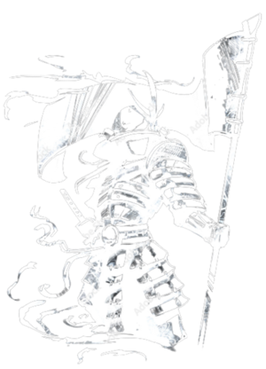

# 🏆 Capture The Flag: Xpl0it Challenge! 🏆

## 🌟 Welcome to the Ultimate Cybersecurity Challenge! 🌟

Get ready to embark on an exhilarating journey into the world of cybersecurity! The **Xpl0it** Capture The Flag (CTF) challenge is crafted for everyone—whether you’re a curious beginner or a seasoned expert. Put your skills to the test, solve intricate puzzles, and compete for fantastic prizes!

    

---

## 🔍 Event Details

- **📅 Date:** 24 October 2024
- **⏰ Duration:** 24 Hours of Non-Stop Action!
- **📍 Location:** Agilisium Consulting, Chennai, Tamil Nadu
- **📝 Registration:** [Click here to Register!](#)

---

## 💻 What You’ll Learn

Join us to unlock the secrets of:

- Cybersecurity fundamentals
- Exploit development
- Digital forensics
- Cryptography techniques
- And so much more!

---

## 🥇 Prizes Await!

Show off your skills and compete for these amazing rewards:

- **1st Place:** $500 + Certificate of Excellence
- **2nd Place:** $300 + Certificate of Achievement
- **3rd Place:** $200 + Certificate of Participation

---

## 👤 About the Creator

This thrilling CTF is created & organized by **Rahulkrishnan Ravindran**.

- 📧 Contact: [rahulkrishnanravindran@gmail.com](mailto:rahulkrishnanravindran@gmail.com)
- 💼 LinkedIn: [rahulkrishnanravindran](https://www.linkedin.com/in/rahulkrishnan-ravindran-7892a7263/)
- 🏳️ Flag: []

---

## 🚀 Get Ready to Challenge Yourself!

Seize this unique opportunity to sharpen your cybersecurity skills and connect with like-minded enthusiasts. Prepare to decode mysteries, uncover secrets, and enhance your knowledge in an engaging atmosphere!

---

## 🎉 Let's Make It Fun!

Spread the word! Gather your friends and join this exciting adventure. Together, we’ll foster a dynamic environment of learning, growth, and competition.

---

**Join us, and let the games begin! 🕹️**
